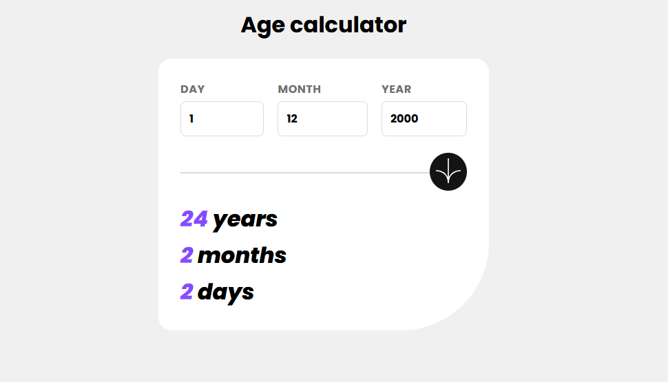

# Frontend Mentor - Age Calculator App Solution

This is a solution to the [Age Calculator App challenge on Frontend Mentor](). Frontend Mentor challenges help you improve your coding skills by building realistic projects.

## Table of contents

- [Overview](#overview)
  - [The challenge](#the-challenge)
  - [Screenshot](#screenshot)
  - [Links](#links)
- [My process](#my-process)
  - [Built with](#built-with)
  - [Useful resources](#useful-resources)
- [Author](#author)

## Overview

### The challenge

Users should be able to:

- Input their birth date and see their exact age in years, months, and days.
- See validation messages if any field is incomplete or incorrect.
- View a responsive layout suitable for different screen sizes.
- Experience smooth UI interactions with meaningful feedback.

### Screenshot

### Links

- Solution URL: [GitHub Repository](https://github.com/DomilsonFirmino/age-calculator-app)
- Live Site URL: [Live Demo](https://domilsonfirmino.github.io/age-calculator-app/)

## My process

### Built with

- [React](https://reactjs.org/) - JS library
- [TypeScript](https://www.typescriptlang.org/) - Typed JavaScript
- Css Modules

### Useful resources

- [React Docs](https://reactjs.org/docs/getting-started.html) - Helped solidify my React knowledge.
- [TypeScript Handbook](https://www.typescriptlang.org/docs/handbook/intro.html) - Enhanced my TypeScript understanding.

## Author

- Frontend Mentor - [@DomilsonFirmino](https://www.frontendmentor.io/profile/DomilsonFirmino)
- GitHub - [DomilsonFirmino](https://github.com/DomilsonFirmino)
- LinkedIn - [Domilson Firmino](https://www.linkedin.com/in/domilson-firmino)
